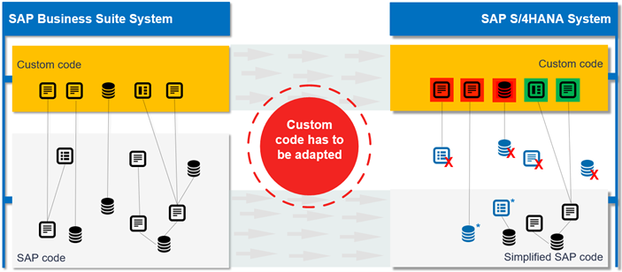
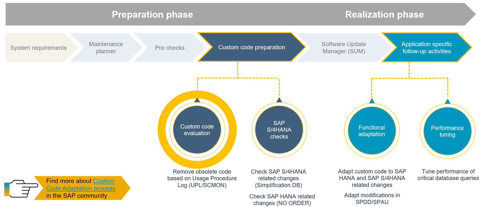

# SAP Custom Code Adaptation for SAP S/4HANA

<!-- Please include descriptive title -->

<!--- Register repository https://api.reuse.software/register, then add REUSE badge:

-->

## Description
This repository contains the material for **Custom Code Adaptation for SAP S/4HANA**.

**Table of Content**
- [CCM100 - SAP Custom Code Adaptation for SAP S/4HANA](#ccm100---sap-custom-code-adaptation-for-sap-s4hana)
  - [Description](#description)
  - [Motivation](#motivation)
  - [Overview of the Conversion Process](#overview-of-the-conversion-process)
  - [Key Aspects of Custom Code Adaptation](#key-aspects-of-custom-code-adaptation)
      - [Types of Projects](#types-of-projects)
      - [Migration Process](#migration-process)
      - [Additional Information](#additional-information)
  - [General Information](#general-information)
  - [📋Requirements for attending this workshop](#requirements-for-attending-this-workshop)
  - [System access (workshops provided by SAP)](#system-access-workshops-provided-by-sap)
  - [🔎Overview](#overview)
    - [About the Scenario](#about-the-scenario)
  - [🛠Exercises](#exercises)
    - [🛠Exercise Summary](#exercise-summary)
    - [🛠Exercise Details](#exercise-details)
  - [📤Solution Package](#solution-package)
  - [🔁Recordings](#recordings)
  - [⚠Known Issues](#known-issues)
  - [🆘How to obtain support](#how-to-obtain-support)
  - [Further Information](#further-information)
  - [License](#license)

## Motivation
Since years SAP customers invested heavily into custom developments related to the SAP Business Suite. In the SAP S/4HANA a lot of SAP code was simplified and, in some cases, changed in a not compatible way (e.g. remove of database tables, data types and data model changes). Therefore, during system conversion from a SAP ERP system to SAP S/4HANA custom code needs to be adapted. The Simplification Database stores and describes all incompatible changes of the SAP code in SAP S/4HANA including the guidance (via SAP Notes) how the related custom code can be adapted. SAP provides tools based on the Simplification Database to detect custom code, which needs to be adapted to SAP S/4HANA and carry out functional adaptation.

Custom Code Migration is part of the system conversion process from the classic SAP Business Suite running on any database to the SAP S/4HANA system. In the context of this system conversion, custom ABAP code needs to be adapted, since a lot of SAP code within SAP S/4HANA was simplified and in some cases changed in a non-compatible way.

Custom Code Migration refers to the process of analyzing and adapting existing custom ABAP code to ensure its readiness for SAP S/4HANA. This process involves several steps and tools to facilitate the migration and ensure compatibility with the target environment.

Some of your custom code objects are not valid anymore and either do not perform as expected or produce syntax errors or dumps (red objects in the picture). You almost certainly have other objects that do perform as expected and do not need to be changed (green objects in the picture).
SAP provides tools, based on the Simplification Database, that detect any custom code that needs to be adapted to SAP S/4HANA. The Simplification Database is a database table in the SAP S/4HANA system that contains all Simplification Items that refer to SAP objects simplified in SAP S/4HANA. Each simplification item describes changed or removed SAP objects and refers to a dedicated SAP Note that describes the impact of the change and how the related custom code can be adapted.

To analyze the required adaptations, you need to set up a system based on SAP NetWeaver AS for ABAP 7.52 that operates as a Central Check System. Using this Central Check System, you can perform remote custom code checks in ABAP Test Cockpit (ATC) for one or more systems in your landscape. 

This material focuses on the custom code related process, from checking custom code remotely, then analyzing the findings, and finally adapting the custom code. Read this guide carefully to get instructions on how to adapt your custom code to SAP S/4HANA 1909.

## Overview of the Conversion Process
SAP provides a process for the system conversion to SAP S/4HANA. The following figure gives you an overview of the tools, the phases, and the activities involved in the process.

The Custom Code Migration process describes the tools and necessary activities that help you to migrate custom code. The process consists of preparatory analysis (Custom Code Analysis) and the adaptation of the custom code (Custom Code Adaptation) after the technical conversion.

## Key Aspects of Custom Code Adaptation
To prepare the system conversion, we recommend that you evaluate your custom code and remove any obsolete code as indicated in the Usage Procedure Log (UPL/SCMON). For more information, see ABAP Call Monitor (SCMON) – Analyze usage of your code.
In addition, your custom code needs to be checked with ABAP Test Cockpit (ATC) against the SAP S/4HANA simplifications in the Simplification Database and for any SAP HANA related changes. The result is a list of findings where your custom code does not comply with the scope and data structure of SAP S/4HANA. At this step you can estimate the required effort required to adapt custom code to migrate to SAP S/4HANA.

#### Types of Projects
One essential part the Custom Code Adaptation is the Custom Code Migration Fiori App. The Custom Code Migration app enables you to create three different kinds of projects:
1. **SAP S/4HANA Migration Project:** Analyze custom code that shall be migrated from an existing product like SAP Business Suite to a new product such as SAP S/4HANA 2023. It performs SAP S/4HANA custom code checks to evaluate the custom objects to be adapted.
2. **SAP BTP Analysis Project:** Analyze custom code for readiness to run in SAP BTP ABAP environment.
3. **Custom Code Analysis Project:** Analyze custom code with arbitrary ATC check variants. This includes performing dependency and complexity analyses.

#### Migration Process
1. **Code Analysis:** The custom code migration process analyzes your existing code for cloud-readiness. Tools like the Custom Code Migration app and ABAP Test Cockpit (ATC) are used to identify functional or security vulnerabilities in your ABAP source code.
2. **Adapting Code:** After analyzing the code, necessary changes are made to adapt the code for the target environment.

####  Additional Information
Unused Code Identification: The Custom Code Migration app supports identifying unused custom code based on collected usage data, enabling the removal of unused code during system conversion to SAP S/4HANA.

**For more detailed steps and guidelines, you can refer to the following resources:**
* [Custom Code Migration Guide to SAP S/4HANA](https://help.sap.com/doc/9dcbc5e47ba54a5cbb509afaa49dd5a1/latest/en-US/CustomCodeMigration_EndtoEnd.pdf)

## General Information
This document outlines our general product direction and should not be relied on in making a purchase decision. This document is not subject to your license agreement or any other agreement with SAP. SAP has no obligation to pursue any course of business outlined in this document or to develop or release any functionality mentioned in this document. This document and SAP's strategy and possible future developments are subject to change and may be changed by SAP at any time for any reason without notice. This document is provided without a warranty of any kind, either express or implied, including but not limited to, the implied warranties of merchantability, fitness for a particular purpose, or non-infringement. SAP assumes no responsibility for errors or omissions in this document, except if such damages were caused by SAP intentionally or grossly negligent.

## 📋Requirements for attending this workshop 
[^Top of page](#)

To complete the practical exercises in this workshop, you need the latest version of the ABAP Development Tools for Eclipse (ADT) on your laptop or PC and the access to the ABAP system.

  
Click to expand!

The requirements to follow the exercises in this repository are:
1. [Install the latest Eclipse platform and the latest ABAP Development Tools (ADT) plugin](https://developers.sap.com/tutorials/abap-install-adt.html)
2. [Adapt the Web Browser settings in your ADT installation](https://github.com/SAP-samples/abap-platform-rap-workshops/blob/main/requirements_rap_workshops.md#4-adapt-the-web-browser-settings-in-your-adt-installation)
3. SAPGUI installed

> ℹ️ **Regarding SAP-led events such as "ABAP Developer Day" and "SAP CodeJam"**:   
> → A dedicated ABAP system for the hands-on workshop participants will be provided.   
> → Access to the system details for the workshop will be provided by the instructors during the session.

## System access (workshops provided by SAP)

In a workshop that is conducted by SAP a SAP S/4HANA 2023 preconfigured appliance system will be provided to the workshop participants. 

The system details will be provided by the trainers. With the system details you can connect via ADT to the system as described in the following how-to-guide.   

[How to connect with ADT to a preconfigured appliance system](https://github.com/SAP-samples/abap-platform-rap-workshops/blob/main/how_to_connect_with_adt_to_preconfigure_appliance.md)

## 🔎Overview
[^Top of page](#)

<!-- #### Current Business Scenario -->
Learn about the current business scenario and the 3-tier extensibility model.
 

Click to expand!

 
### About the Scenario 
The document is a comprehensive guide for participants focused on adapting custom ABAP code for SAP S/4HANA using various tools and methodologies. It outlines the challenges of migrating custom code due to simplifications in SAP S/4HANA and introduces tools like the ABAP Call Monitor, Simplification Database, and ABAP Test Cockpit (ATC) for analysis and adaptation. The exercises walk users through hands-on tasks using Eclipse-based ABAP Development Tools and Fiori apps to identify, analyze, and fix code incompatibilities. It also covers the use of ABAPGit for cloud migration and developing Fiori apps in the Steampunk environment. Overall, the document serves as a practical, step-by-step training resource for developers preparing for SAP S/4HANA transitions.

## 🛠Exercises
### 🛠Exercise Summary
[^Top of page](#)

The exercises in the document are designed to guide you through the process of adapting custom ABAP code for SAP S/4HANA. Here's a breakdown of the key exercises:

1. **ABAP Call Monitor (/SDF/SCMON and SUSG):** Learn how to collect and analyze usage data of custom ABAP programs to identify obsolete or unused code.
2. **Simplification Database (SYCM):** Explore how to use the Simplification Database to identify SAP S/4HANA changes that impact custom code and navigate related SAP Notes for adaptation guidance.
3. **ABAP Test Cockpit (ATC):** Perform remote code checks to detect incompatibilities with SAP S/4HANA and analyze findings using the ATC Statistics View.
4. **Fiori Custom Code Migration App:** Create and scope a migration project, analyze findings, and prepare transport requests for system conversion.
5. **ABAP Development Tools (ADT):** Use Eclipse-based tools to create and run ABAP programs, explore development features, and apply quick fixes to code issues.
6. **Adapt Custom Code:** Apply ATC findings to fix broken custom programs post-conversion, using SAP Notes and quick fixes.
7. **ABAPGit:** Migrate existing code to the SAP Cloud Platform ABAP Environment using Git-based workflows.
8. **Develop a Fiori App in Steampunk:** Create a Fiori application using modern ABAP and SAPUI5 technologies in the cloud-based Steampunk environment.

### 🛠Exercise Details
| Exercises |  |
| ------------- | -- |
| [System and Logon Information](exercises/ex0/README0.md) |  |
| [Exercise 1 - ABAP Call Monitor](exercises/ex1/README1.md) |  |
| [Exercise 2 - The Simplification Database](exercises/ex2/README2.md) |  |
| [Exercise 3 - ABAP Test Cockpit (ATC) - Check your Custom Code using Remote ATC](exercises/ex3/README3.md) |  |
| [Exercise 4 - The Custom Code Migration Fiori App](exercises/ex4/README4.md) |  |
| [Exercise 5 - ABAP Development Tools (ADT) (optional)](exercises/ex5/README5.md) |  |
| [Exercise 6 - Adapt your Custom Code](exercises/ex6/README6.md) |  |
| [Exercise 7 - ABAPGIT - Migrate existing Code to the SAP BTP ABAP Environment (Steampunk)](exercises/ex7/README7.md) | |
| [Exercise 8 - Develop a Fiori App in the SAP BTP ABAP Environment (Steampunk)](exercises/ex8/README8.md) |  |

## 📤Solution Package
[^Top of page](#)
 
You can add the solution package **`Z_CCM_SOLUTIONS`** into your Favorite Packages in your ABAP Development Tools (ADT).

> ℹ️ **Regarding SAP-led events such as "ABAP Developer Day" and "SAP CodeJam"**:     
> The solution package **`Z_CCM_SOLUTIONS`** is already imported into your dedicated system used during these events.

🚧 _More information coming soon_  

## 🔁Recordings
[^Top of page](#)

Lorem Ipsum 

📹 <a href="http://www.youtube.com/watch?feature=player_embedded&v=MThRxtNEHS0" target="_blank">Cloud API Enablement on SAP S/4HANA and SAP S/4HANA Cloud Private editions</a> 

## ⚠Known Issues
[^Top of page](#)

No known issues. 

## 🆘How to obtain support
[^Top of page](#)

[Create an issue](../../issues) in this repository if you find a bug or have questions about the content.
 
For additional support, [ask a question in SAP Community](https://answers.sap.com/questions/ask.html).

## Further Information
[^Top of page](#)

You can find further information here:
 - [Blog Post on how to mitigate missing released SAP APIs in SAP S/4HANA Cloud](https://blogs.sap.com/2023/05/24/abap-cloud-how-to-mitigate-missing-released-sap-apis-in-sap-s-4hana-cloud-private-edition-and-sap-s-4hana-the-new-abap-cloud-api-enablement-guide/) | SAP Community
 - [Detailed document on ABAP Cloud API Enablement Guidelines](https://www.sap.com/documents/2023/05/b0bd8ae6-747e-0010-bca6-c68f7e60039b.html) | Guide
 - [ABAP RESTful Application Programming Model (RAP)](https://community.sap.com/topics/abap/rap) | SAP Community page   
 - Most frequently asked questions: [ABAP Cloud FAQ](https://community.sap.com/topics/abap/abap-cloud-faq) | [RAP FAQ](https://blogs.sap.com/2020/10/16/abap-restful-application-programming-model-faq/)    
 - [RAP640 Tutorials Group: Mitigate Missing Released SAP API in the 3-tier Extensibility Model](https://developers.sap.com/group.sap-s4hana-extensibility-wrap-api.html) | SAP Developers' Center
 - [Various hands-on workshop materials on ABAP Cloud, including RAP and embedded analytics](https://github.com/SAP-samples/abap-platform-rap-workshops/blob/main/README.md) 

<!--
## Contributing
If you wish to contribute code, offer fixes or improvements, please send a pull request. Due to legal reasons, contributors will be asked to accept a DCO when they create the first pull request to this project. This happens in an automated fashion during the submission process. SAP uses [the standard DCO text of the Linux Foundation](https://developercertificate.org/).
-->

## License
Copyright (c) 2025 SAP SE or an SAP affiliate company. All rights reserved. This project is licensed under the Apache Software License, version 2.0 except as noted otherwise in the [LICENSE](LICENSE) file.

