## Exercise 1 - ABAP Call Monitor and Usage Data

- [Exercise 1 - ABAP Call Monitor and Usage Data](#exercise-1---abap-call-monitor-and-usage-data)
  - [Introduction](#introduction)
  - [You will learn](#you-will-learn)
  - [/SDF/SCMON](#sdfscmon)
  - [SUSG](#susg)
  - [Summary \& Next Exercise](#summary--next-exercise)
    - [Summary](#summary)
    - [Next Exercise](#next-exercise)

<!-- Exercise Description -->
### Introduction
The ABAP Call Monitor is a tool designed to help you examine the performance of your implemented business logic in the ABAP environment. It allows you to:

The Usage Data allows you to aggregate and manage data of the ABAP Call Monitor.

Identify runtime-intensive statements: By using function modules and global ABAP classes, you can pinpoint statements that consume significant runtime.
Follow the hierarchy of program calls: The ABAP trace, which is the result of the ABAP Profiler, helps you trace the sequence of program calls, providing a detailed view of the execution flow.

### You will learn  
- How to use transaction /SDF/SCMON to collect runtime data about which custom code objects are being executed.
- How to analyze collected data using tools like the Call Graph and Log Browser to understand program behavior and identify potential issues.
- How to use transaction SUSG to aggregate and manage the collected usage data, create snapshots, and export them for further analysis.

---
> **Reminder:**   
> Don't forget to replace all occurences of the placeholder **`###`** with your assigned group number in the exercise steps below.  
---


### /SDF/SCMON

---

<details>
    <summary>🔵 Exercise 1.1 >> Click to expand</summary>

1. Logon to the Checked System within your ABAP Development Tools to your SAP ERP 6.0 EhP7 system (A4H).

           Use the provided logon information.

2. Create a new ABAP project
3. Logon to the system with the provided User: DEVELOPER## Password: Welcome1 Client: 001
4. Add your exercise package Z_CCM_EX_## to your favorite packages.
5. Run any of your programs within your favorite packages e.g.  
    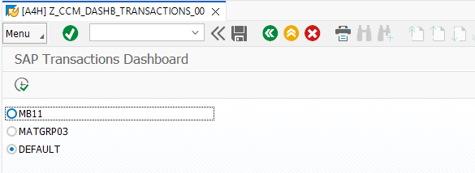
    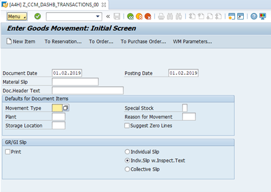
6. Start transaction: ```/SDF/SCMON (ABAP Call Monitor)```
    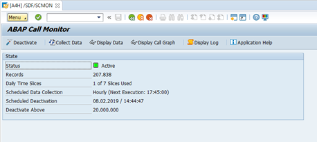
7. Execute Collect Data.   
    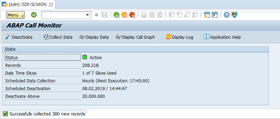
8. Analyze the data by filtering for your executed programs by using ```Display Data```
    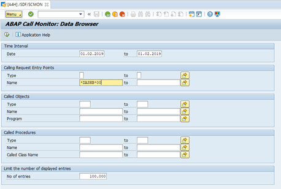
    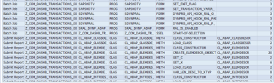
9.	Use the ABAP Monitor Call Graph to check what was called from you program
    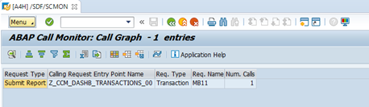
10. Use the ABAP Call Monitor Log Browser and check if there are any errors.
    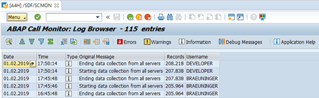
</details>

---

### SUSG

---

<details>
  <summary>🔵 Exercise 1.2 >> Click to expand</summary>

11. Start Transaction SUSG   
    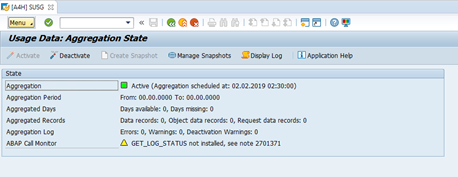
12. Check whether all ABAP Call Monitor data was aggregated
    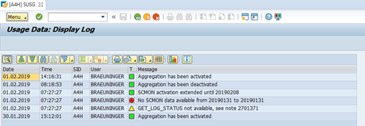
    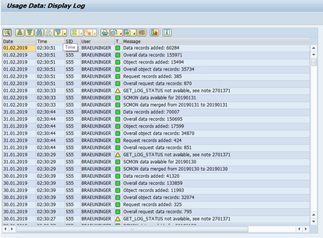
13.	Create a new snapshot. Check if a day of the aggregated  ABAP Call Monitor data is missing
    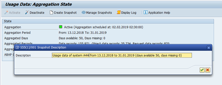
14.	Manage your snapshots   
    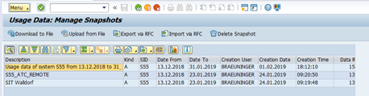
15.	Download your snapshot to your local file system or push it to anywhere else.
    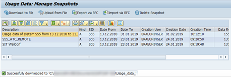
</details>

---

### Summary & Next Exercise
[^Top of page](#)

#### Summary

**You learned how to:**

- 🔍 **Use Transaction /SDF/SCMON to Collect Runtime Data**
  - This transaction monitors which custom code objects are executed during normal system usage.
  - It captures runtime usage data at the ABAP statement level, helping identify actively used custom code.
  - Ideal for usage-based custom code analysis during S/4HANA readiness checks.
- 🧠 **Analyze Data with Call Graph and Log Browser**
  - Use the Call Graph to visualize the execution flow of programs and understand dependencies.
  - The Log Browser helps inspect detailed runtime logs, making it easier to:
    - Trace program behavior
    - Identify performance bottlenecks
    - Spot unused or rarely used code
- 📊 **Use Transaction SUSG to Aggregate and Manage Usage Data**
  - SUSG allows you to:
    - Aggregate collected SCMON data
    - Create snapshots of usage data for specific timeframes
    - Export data for further analysis or archiving
  - Useful for long-term monitoring and custom code optimization.

#### Next Exercise
Now you can continue with the next exercise - **[Exercise 2 - The Simplification Database](../ex2/README2.md)**.

---
