## Exercise 2 - The Simplification Database

- [Exercise 2 - The Simplification Database](#exercise-2---the-simplification-database)
  - [You will](#you-will)
  - [The Simplification Database](#the-simplification-database)
  - [Summary \& Next Exercise](#summary--next-exercise)
    - [Summary](#summary)
    - [Next Exercise](#next-exercise)

<!-- Exercise Description -->
In this exercise, you will use the transaction SYCM to get the overview of the SAP Business Suite source code affected by the simplifications in the SAP S/4HANA. You will search in the Simplification Database for certain objects, navigate to the affected objects and read the SAP Notes to understand the change in SAP S/4HANA and receive more detailed information on functional adaptations to SAP S/4HANA. You will do this exercise in the ATC central check system, where the Simplification Database is already available.

### You will
- Get familiar with the transaction SYCM
- Get overview about the Simplification Database content
- Search for simplifications related to certain objects/object types
- Navigate and read the relevant SAP Notes      
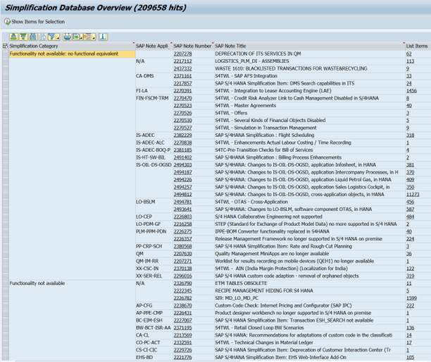
 
 ---
> **Reminder:**   
> Don't forget to replace all occurences of the placeholder **`###`** with your assigned group number in the exercise steps below.  
---

### The Simplification Database

---

  
🔵 Exercise 2 >> Click to reveal the exercise

1.    Logon to the Central Check System (S/4 HANA 09 System). Use the provided logon information for system Central Check System.    

      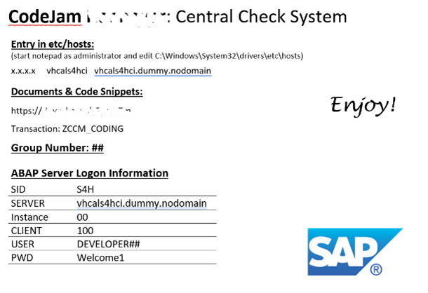

---
2.    Open SAP Logon on your desktop and connect to the central ATC check system S4H by entering your logon data and run Transaction **`SYCM`.

      <table><tr><th>System</th><th>Logon Information</th></tr>
      <tr><td>Central ATC Check System (SAP S/4HANA 2023 FPS03)</td><td></td></tr>
      <tr><td><b>Client</b></td><td>100</td></tr>
      <tr><td><b>User</b></td><td>DEVELOPER##</td></tr>
      <tr><td><b>Password</b></td><td>Welcome1!</td></tr>
      <tr><td><b>Transaction</b></td><td>SYCM</td></tr>
      </table>
      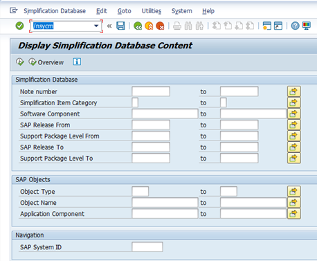

---
1.    Select **`Overview`** to display the SAP S/4HANA simplifications. The simplification items are grouped by the Simplification Category (e.g. ERP functionality is not available in S/4HANA or is available but was changed in an incompatible way).

      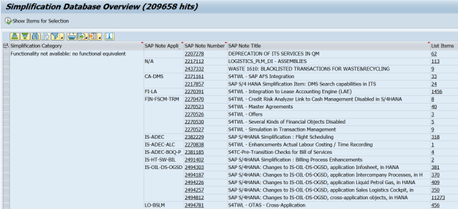
---
4.    Choose an SAP Note title within a Simplification Category and list the affected by this simplification objects by clicking on the underlined items number.

      **Explanation**: this SAP Note describes the material number field extension from 18 to 40 characters in SAP S/4HANA.

      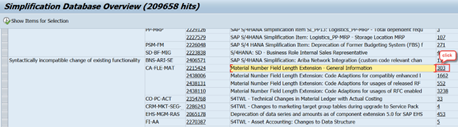
      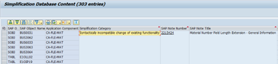

---
5.    Go back (Back (F3) button) to the transaction SYCM entry screen, type **`MATNR`** into Object Name field and click Show Content (F8) button to display related objects to the MATNR change. Navigate to the corresponding SAP Note.

      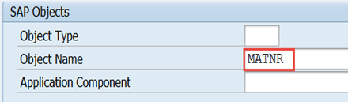
      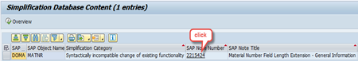
      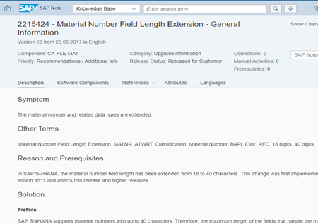

---
6. Go back (Back (F3) button) to the transaction SYCM entry screen, type **`TRAN`** into Object Type field and type “M*” into Object Name field and click Show Content (F8) button to display simplifications in all transactions beginning with M. You may click on the SAP Notes numbers to understand the simplification.

      Play around with the SYCM transaction to get know it better.

      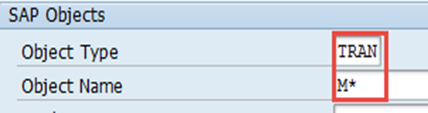
      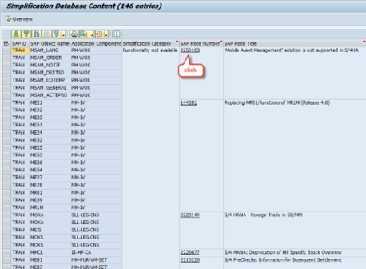

---

### Summary & Next Exercise
[^Top of page](#)

#### Summary 

**You learned how to:**

- 🔧 **Familiarize with Transaction SYCM**
  - Learn how to use the SAP transaction SYCM (Simplification Item Check), which helps identify custom code and objects impacted by simplifications in SAP S/4HANA.

- 📚 **Understand the Simplification Database**
  - Get an overview of the Simplification Database, which contains all simplification items introduced in S/4HANA. Each item explains what has changed, why, and how to adapt.

- 🔍 **Search for Relevant Simplifications**
  - Use filters or keywords to search for simplification items related to specific objects or object types (e.g., programs, function modules, tables).

- 📄 **Navigate and Read SAP Notes**
  - For each simplification item, review the linked SAP Notes to understand the technical and functional impact, as well as guidance on how to adapt your system or code.

#### Next Exercise
You can continue with the next exercise - **[Exercise 3 - ABAP Test Cockpit (ATC) - Check your Custom Code using Remote ATC](../ex3/README3.md)**.