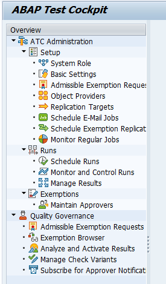
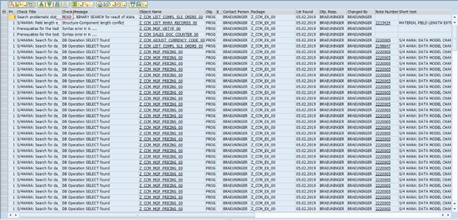
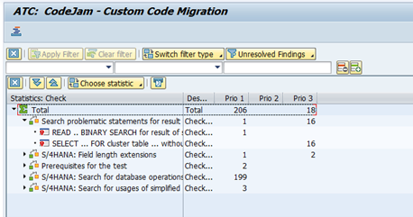

## Exercise 3 - ABAP Test Cockpit (ATC) - Check your Custom Code using Remote ATC

- [Exercise 3 - ABAP Test Cockpit (ATC) - Check your Custom Code using Remote ATC](#exercise-3---abap-test-cockpit-atc---check-your-custom-code-using-remote-atc)
  - [In this exercise you will](#in-this-exercise-you-will)
  - [The Custom Code Migration Fiori App](#the-custom-code-migration-fiori-app)
  - [Summary \& Next Exercise](#summary--next-exercise)
    - [Summary](#summary)
    - [Next Exercise](#next-exercise)
  - [Notes](#notes)

<!-- Exercise Description -->
With **ABAP Test Cockpit (ATC)** you can run static code checks to find functional, performance and security bugs in your custom code. ATC supports QM gates, regression tests and exemptions and is a foundation for smooth migration of ABAP custom code to SAP S/4HANA. Find more information on ATC in the SAP Community: https://www.sap.com/community/topic/abap-testing-and-analysis.html 

In this exercise, you get an overview of the ATC transaction and learn its basic tasks like scheduling ATC run series, using ATC Statistics View, working with ATC result list, finding information on how to proceed with ATC findings. You will use remote code analysis in an ATC central check system (SAP_BASIS 7.52) to check your custom code objects in a SAP ERP system (SAP ERP 6.0 EhP3) to detect all their incompatibilities with SAP S/4HANA.

### In this exercise you will
- Get to know the transaction ATC 
- Configure ATC in a central check system for remote code analysis of an SAP ERP system
- Create and schedule ATC run series for S/4HANA readiness for your ERP custom objects
- Work with the ATC Statistics View
- Display and filter ATC result
- Get detailed information on an ATC finding
- Navigate to source code from ATC result

---
> **Reminder:**   
> Don't forget to replace all occurences of the placeholder **`###`** with your assigned group number in the exercise steps below.  
---

### The Custom Code Migration Fiori App

- [You will learn](#you-will-learn)
- [Summary & Next Exercise](#summary--next-exercise) 

---

  
🔵 Exercise 3 >> Click to reveal the exercise

1.    Logon to the **Central Check System (S/4 HANA 2023 System)**.

      Use the provided logon information for system *Central Check System*.   
      
      

---
2.    Start transaction ATC   
      
      

---
4.    Now configure the Object Provider, which defines the RFC connection to be used for analysis of your custom code in the remote ERP system.

      In the ATC Overview tree select Object Providers node and double click it.    
      
      

      Switch to change mode and then click the New Entries button.      
      
      

      Enter your data.

      Click Save button.

---
5.    In the ATC Overview tree select Schedule Runs node and double click it.       
      
      

---
6.    Click Create button, enter the Run Series name DEVELOPER## and click Enter button on the popup. 
      
      

---
7.    Enter a description and choose the variant

      *S4HANA_READINESS_xyz / SAP_CP_READINESS_REMOTE*    

      

---
8.    Enter your exercise package Z_CCM_EX_##.  
      
      

---
9.    Execute the Remote check by using the Schedule button.      
      
      

---
10.    Go back to the ATC Overview screen and double click the Manage Results node. On the ATC - Browse Results screen enter your ATC run series name <YOUR NAME> and click Execute (F8). 
      

---
1.    You can view the result only after the ATC run is finished (TIP: under the Monitor and Control Runs node you can view the run status).

      Select your result in the table and click Display button.
      
      

---
12.   The result table displays all ATC findings of the simplifications in SAP S/4HANA which affect the custom code in your scanned package

      *Z_CCM_EX_##*

      of the remote ERP system incl. the corresponding SAP Notes for solution guidance.

      

---
13.   Now open the Statistics View  
      

---
14.   In the Statistics View the ATC result is grouped by the ATC checks. For example, display all ATC findings related to the SELECT statements without ORDER BY clause. To achieve this just double click the relevant ATC check in the selection tree. From here you can also navigate to the corresponding source code part by clicking on the Object Name.   
      

---

### Summary & Next Exercise
[^Top of page](#)

#### Summary
**You learned how to:**

- 🛠️ **Get to Know Transaction ATC**
  - ATC is a central tool for static code analysis in ABAP.
  - It helps identify syntax errors, performance issues, security risks, and S/4HANA simplification impacts in custom code. 
  
- 🌐 **Configure ATC in a Central Check System**
  - Set up a central ATC check system to perform remote code analysis on connected SAP ERP systems.
  - This setup allows centralized management of checks and results across multiple systems.

- 📅 **Create and Schedule ATC Run Series**
  - Define ATC run series to regularly check custom code for S/4HANA readiness.
  - Schedule runs to analyze:
  - Simplification items
  - Syntax compatibility
  - Performance and security issues

- 📊 **Work with the ATC Statistics View**
  - Use the Statistics View to get an overview of check results:
    - Number of findings
    - Severity levels
    - Object types affected

- 🔍 **Display and Filter ATC Results**
  - Filter results by:
    - Check type
    - Priority
    - Package or object name
  - Helps focus on critical issues first.

- 📄 **Get Detailed Information on an ATC Finding**
  - Description of the issue
  - Recommendation for resolution
  - Linked SAP Notes (if applicable)

- 🧭 **Navigate to Source Code from ATC Result**
  - Directly jump from the ATC result to the affected source code.
  - Enables quick inspection and correction of issues.

#### Next Exercise
You can continue with the next exercise - **[Exercise 4 - The Custom Code Migration Fiori App](../ex4/README4.md)**.

### Notes
- [ATC Remote Analysis >> 2364916 - Recommended SAP Notes for using ATC to perform remote analysis](https://me.sap.com/notes/2364916).