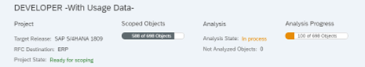
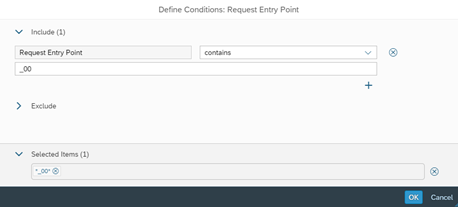

## Exercise 4 - The Custom Code Migration Fiori App

- [Exercise 4 - The Custom Code Migration Fiori App](#exercise-4---the-custom-code-migration-fiori-app)
  - [Key Features](#key-features)
  - [You will learn](#you-will-learn)
  - [The Custom Code Migration Fiori App](#the-custom-code-migration-fiori-app)
    - [Custom Code Migration - Create a Project](#custom-code-migration---create-a-project)
    - [Custom Code Migration - Scoping](#custom-code-migration---scoping)
    - [Custom Code Migration - Analysis](#custom-code-migration---analysis)
    - [Custom Code Migration - Save a Transport](#custom-code-migration---save-a-transport)
  - [Summary \& Next Exercise](#summary--next-exercise)
    - [Summary](#summary)
    - [Next Exercise](#next-exercise)


<!-- Exercise Description -->
The Custom Code Migration Fiori Application enables you to analyze your custom code that needs to be migrated from an SAP Business Suite system to SAP S/4HANA (on-premise). To evaluate the development objects to be adopted, it performs the S/4HANA custom code checks. 

In addition, this app supports you with identifying unused custom code based on your collected usage data. This enables you to remove unused custom code during a system conversion to SAP S/4HANA. 


The Custom Code Migration app serves several purposes:

**1. SAP S/4HANA Migration Project**
* It analyzes custom code that needs to be migrated from an existing product like SAP Business Suite to a new product such as SAP S/4HANA 2023.
* It performs SAP S/4HANA custom code checks to evaluate the custom objects that need to be adapted 

**2. SAP BTP Analysis Project**
* It analyzes custom code for readiness to run in the SAP BTP ABAP environment 

**3. Custom Code Analysis Project**
* It analyzes custom code with arbitrary ATC check variants.
* It helps in identifying unused custom code based on collected usage data, enabling the removal of unused custom code during a system conversion to SAP S/4HANA 

Additionally, the app supports the migration of existing custom ABAP code for add-on development purposes by analyzing the code for cloud-readiness and enabling migration via abapGit.

More detailed information, you can refer to the following resources:
* [Enable Usage of the Custom Code Migration App](https://help.sap.com/docs/ABAP_ENVIRONMENT/250515df61b74848810389e964f8c367/651ef65d8d37488cb8f84a1fd2ab4455.html?locale=en-US&state=PRODUCTION&version=Cloud)
* [Performing an Analysis](https://help.sap.com/docs/ABAP_ENVIRONMENT/250515df61b74848810389e964f8c367/651ef65d8d37488cb8f84a1fd2ab4455.html?locale=en-US&state=PRODUCTION&version=Cloud)
* [How to Check your Custom ABAP Code for SAP BTP ABAP Environment](https://blogs.sap.com/2018/10/02/how-to-check-your-custom-abap-code-for-sap-cloud-platform-abap-environment/)
* [How to Bring your ABAP Custom Code to SAP BTP ABAP Environment](https://blogs.sap.com/2019/11/11/how-to-bring-your-abap-custom-code-to-sap-cloud-platform-abap-environment/)
 

### Key Features

Create Project with or without Usage Data:

**Scoping**
* You define which ABAP custom code needs to be migrated to be taken over to SAP S/4HANA (based on usage data)
* This app creates a deletion transport in order to delete unused ABAP source code during the system conversion to SAP S/4HANA

**Analysis of SAP S/4HANAcustom code check findings**
* Analytical representation of SAP S/4HANA custom code check findings
* Results can be filtered by scope and usage data

**Save Scope as Transport Request**
* Transport request to be added to the Software Update Manager for the S/4 conversion

### You will learn  
- How to use the Custom Code Migration App

---
> **Reminder:**   
> Don't forget to replace all occurences of the placeholder **`###`** with your assigned group number in the exercise steps below.  
---

### The Custom Code Migration Fiori App

- [You will learn](#you-will-learn)
- [Summary & Next Exercise](#summary--next-exercise) 

#### Custom Code Migration - Create a Project

---

<details>
  <summary>🔵 Click to expand to see the exercise</summary>

---
1.    Logon to the Central Check System (S/4 HANA 2023 System).Use the provided logon information for system.
      
   
---
2. Start your Fiori Launchpad by using transaction /UI2/FLP

      Logon to the system:

      User: DEVELOPER##
      
      Pwd: Welcome1!

      

---
3. Create a Project. Launch the Custom Code Migration app to analyze which custom code has to be adapted if we convert our system A4H to SAP S/4HANA 2023.

      Use the RFC Destination: **```ERP***```
      to connect to our ERP development system.

      Don’t miss to add the usage data which is available in system A4H.

---
4. Create a new Project    
      

---
5. Enter appropriate data     
      

---
6.    Add Usage Data from the A4H system by using the F4 help.    
      

---
7.    Select the last entry   
      

---
8.    Save your project       
      

---
9.    **Refresh** your project from time to time to see the progress.       
      
      
      
      

</details>

---

#### Custom Code Migration - Scoping

---

<details>
  <summary>🔵 Click to expand to see the exercise</summary>

---
10.    We don’t want to take-over all custom code to S/4HANA. Please change the scope and remove following objects:
* ```Z_CCM_ADJUST_CURRENCY_CODE_##```
* ```Z_CCM_SALES_DOC_COUNTER_##```

---
11. To remove the ojects **Navigate** to the Scope Overview       
      

---
12.   **Filter** for your development objects using the F4-Help of the:

      * Request Entry Point with the search field located in your exercise package
        * Z_CCM_EX_##
  
      
      
      

---
13.   Sort your list by the field 

      Last Usage in ascending order

      

---
14.   Group your list by

      Last Usage

      
---
15.   Remove all applications which have not been used in 2019 from the scope.

      

---
16.   Because there is a New Development Project ongoing and since there is no usage data currently available. Therefore, start the Scope Packages app and navigate to the package

      Z_CCM_EPM

      

---
17.   As you can see not all objects are taken into account by default.

      Add the package to the scope.

      
 
</details>

---

#### Custom Code Migration - Analysis
<details>
  <summary>🔵 Click to expand to see the exercise</summary>

---

1.    **Analysis with the Analytical List Page**
    
      We want to start the effort estimation for our custom code adaptation. As far as we understood we should have the following numbers in place:
2.    How many findings do we have overall?   
            
3.    How many findings are related to the custom code objects we take over to SAP S/4HANA?
            
4.    How many findings can be fixed using quick fixes?   
            
5.    What are the top 3 areas (i.e., which SAP Note numbers) we have findings?   
            
6.    Which package do we have the most findings?   
            
5. Next task is to provide a list of all findings in Excel.       
      
</details>

---

#### Custom Code Migration - Save a Transport

---

<details>
  <summary>🔵 Click to expand to see the exercise</summary>

---
1.    Finally, after all the scoping and analysis tasks lets create a transport request which is taken into the SUM for the S/4HANA conversion.information for system.  
      
2.    Navigate back to the A4H system and check if all scoped objects are missing (because this is a deletion request)?
      
</details>

---

### Summary & Next Exercise
[^Top of page](#)

#### Summary
**You learned how to:**

- 📘 **How to use the Custom Code Migration App effectively to**
    - Scope and analyze custom code
    - Clean up unused code
    - Prepare for a smooth S/4HANA transition

#### Next Exercise
You can continue with the next exercise - **[Exercise 5 - ABAP Development Tools (ADT) (optional)](../ex5/README5.md)**.

