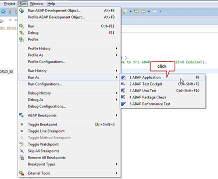
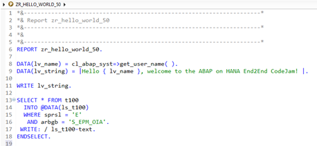

## Exercise 5 - ABAP Development Tools (ADT) (optional)

- [Exercise 5 - ABAP Development Tools (ADT) (optional)](#exercise-5---abap-development-tools-adt-optional)
  - [You will learn](#you-will-learn)
  - [ABAP Development Tools (ADT)](#abap-development-tools-adt)
    - [Create an ABAP Project](#create-an-abap-project)
  - [Summary \& Next Exercise](#summary--next-exercise)
    - [Summary](#summary)
    - [Next Exercise](#next-exercise)

<!-- Exercise Description -->
This exercise introduces the ABAP Development Tools (ADT) known as "ABAP in Eclipse".

ABAP Development Tools for Eclipse (ADT) is SAP’s state-of-the-art integrated development environment (IDE) for ABAP development on the open Eclipse platform. The primary purpose of ABAP Development Tools is to enable ABAP developers to perform development tasks using the ABAP application server capabilities in an Eclipse-based IDE 

**Key Features**
ABAP Development Tools for Eclipse supports ABAP developers with the following possibilities:

* Highly flexible, customizable Eclipse UI for ABAP development tools
* High-performance, failover-safe online development in multiple ABAP systems simultaneously
* Display and edit functionality for multiple ABAP objects in parallel
* Advanced and efficient source code editing including refactoring support
* Optimum support of task-oriented and test-driven development
* Robust and reliable quality assurance and supportability tools
* Built-in extensibility of the IDE using the established Eclipse plug-in technology 

**Specific Features**
In particular, ABAP Development Tools for Eclipse is a modern development toolset where ABAP developers can use features such as:

* Syntax check
* Code completion
* Syntax highlighting
* Pretty printing
* Navigation
* Search
* Quick fixes
* And many more 

 It is the recommended integrated development environment (IDE) for developing ABAP application. This toolset is not mandatory for standard ABAP development such as creation or maintenance of ABAP reports or ABAP classes. However, it becomes mandatory for ABAP for SAP S/4HANA Public Cloud and SAP BTP ABAP Environment development, e.g. for the creation of CDS views or ABAP managed database procedures as you will see in the corresponding CodeJam exercises later on. In such development scenarios, the necessary features are only provided in ADT and not in the ABAP Workbench (SE80).

The ABAP Development Tools provide a set of powerful tools for developing ABAP applications. The tools (Eclipse editors and Eclipse views) are ideally positioned in the IDE to facilitate your tasks. The diagram below shows the default layout of the ABAP perspective:


**Project Explorer View:**
Provides a hierarchical view of your ABAP Projects. From here you can browse the ABAP Development Objects in the ABAP system (similar to the Repository Browser in the Object Navigator (SE80)) and open your ABAP Development Objects in the corresponding editor.

**Editor Area:**
The editors for the ABAP Development Objects are opened in the area reserved in the center of the IDE.

**Outline View:**
This view displays a structured overview of the ABAP Development Object that is currently open in the editor area. The contents of the outline view are editor-specific.

**Feature Explorer View:**
This view provides you with an interactive tutorial to help you get familiar with the basic features in ABAP in Eclipse.

**Other Views:**
Several other useful views are stacked underneath the editor area in a tabbed container. Two of the most commonly used views are the•
o	Problems View:  This view displays the syntax errors, warnings or other information associated with an ABAP Development Object (typically opened in the editor area)
o	Properties View: This view displays the basic properties of the ABAP Development object that is currently open in the editor area, e.g.: "Last changed by", "Created on", etc.
In this exercise you will get familiar with ADT, learning the basic concepts and interaction patterns so that you can develop an end-to-end application from SAP HANA via ABAP to SAP Fiori.

### You will learn  
- How to create an ABAP Project
- How to create, implement, and execute an ABAP program
- How to get helpful information as you move along

---
> **Reminder:**   
> Don't forget to replace all occurences of the placeholder **`###`** with your assigned group number in the exercise steps below.  
> You can use the ADT function **Replace All** (**Ctrl+F**) for the purpose.   
> If you don't have a group number, choose a 3-digit suffix and use it for all exercises.
---

### ABAP Development Tools (ADT)


#### Create an ABAP Project

---

<details>
  <summary>🔵 Exercise 5 >> Click to expand to see the Exercise</summary>

1.    Now, start Eclipse, your Integrated Development Environment (IDE).

---
2.    After the first launch, you will see the Welcome Page. Just close it.
      

---
3.    Switch to the ABAP perspective by clicking the Open Perspective button or via the Menu Window > Open perspective > Other      
      

---
4. Choose the ABAP perspective and press OK     
      

---
5. The ABAP perspective opens, and you’re welcomed by the ABAP Feature Explorer. The layout is as described in the introduction of this exercise, so you know already, why there are so many views in this perspective.
      
      

---
6.    Okay, let’s start with the first step – create an ABAP Project, the central interface between the IDE and the ABAP backend system.  

      

---
7.    In the New ABAP Project dialog, choose “Define Manually”.         

      

---
1.    Enter the connection properties and continue with Next

      

---
9.    You are asked to provide the logon information for system S4H:
      * Client: 100
      * User: DEVELOPER## (## is your group number)
      * Password: Welcome1

      In principle, your project is ready to use, and you could finalize the project creation. Yet, it’s quite helpful to define favorite package, therefore, please continue with Next.

      

---
10.   Add favorite packages to for your project via the Add button. 

      

---
11.   Add your ABAP package
      * Z_CCM_EX_## (## is your group number)

      

---
12.   The ABAP Project is created, and you can see it in the Project Explorer view.
      

---
13.   Let’s customize a bit the ABAP perspective, e.g. close the Feature Explorer.
      
      **Hint:** There’s almost no limit in changing the layout, i.e. you can change the view sizes, re-arrange the layout, close views, open new ones, move the views, etc. This might lead to the situation, where you feel like you messed up everything, in this case, just use Windows > Reset Perspective from the menu bar to reset the ABAP perspective to the default layout. 

      

---
14.   Now, let’s explore a bit the views in the ABAP perspective, e.g. set the focus to the Problems view.

      

---
15.   Initially, there should be no problems. You’ll later understand the purpose of the Problems view.

      

---
16.   Now, let’s expand the ABAP project in the Project Explorer view, using the + indicators
    
      Besides the manually added packages, your $TMP package is added by default to the list of Favorite Packages. And you can see that there’s already some ABAP content in your Z_CCM_EX_## package.

      

---
17.   Ready to create you first ABAP program?

      Just right-click on your exercise package Z_CCM_EX_## to open the context menu and select 
      
      New > ABAP Program.

      **Remark:** The context menu is filled with the recently used object. If you can’t find the menu item New ABAP Repository Object, select 

      New > Other ABAP Repository Object.

      

---
18.   A creation wizard opens. The project and package are automatically included. So, you only have to provide name and description for the ABAP program:

      Name: ZR_HELLO_WORLD_## (with group number ##)

      Description: Valid description like “ADT Exercise”

      

---
19. Typically, the next step is to create or select a transport request. However, the development done in this exercise is performed on package TEST_E2E_EX_## and you’re informed that the change recording is not enabled for the package. So, you can simply proceed via the Finish button.

      

---
20. The ABAP program is created and opened in the editor area, ready for you to implement.

      

---
21.   The next step is to do the necessary ABAP coding. The program should create the output depicted in the screenshot.

      **Hint:** The username is obtained via a class method of CL_ABAP_SYST.

      

---
22.   Add the following code:

      ``` ABAP
            DATA(lv_name) = cl_abap_syst=>get_user_name( ).
            DATA(lv_string) = |Hello { lv_name }, welcome to the ABAP on HANA End2End CodeJam!|.

            WRITE lv_string.
      ```
      
      

---
24.   Trigger the Source Code Formatter aka ABAP Pretty Printer (Shift+F1).

      If not done yet, you have to configure the settings.

      

---
25.   In the following popup window, activate the Checkbox and select your favorite Code style. Continue with the OK button

      

---
26.   **Remark:** If you want to change the ABAP Pretty Printer settings, go in the menu bar to Windows > Preferences. Select ABAP Development > Editors > Source Code Editors and select the Formatter.
      

---
27.   Save (Ctrl+S) and activate (Ctrl+F3) the program.

      

---
28.   Ready to execute the program? 

      You can either use the cumbersome way via 
      *Run > Run As > ABAP Application* or just use ABAP Shortcut F8.

      

---
29.   An embedded SAPGUI opens, and the result is displayed as depicted in the screenshot.

      

---
30.   Let’s explore some more features of the ABAP Development Tools.

      Enter the following coding:

      ``` ABAP
            DATA(lv_name) = cl_abap_syst=>get_user_name( ).
            DATA(lv_string) = |Hello { lv_name }, welcome to the ABAP on HANA End2End CodeJam!|.

            WRITE lv_string.

            SELECT * FROM t100
                  INTO @DATA(ls_t100)
                  WHERE sprsl = 'E'
                   AND arbgb = 'S_EPM_OIA'.
                  
                  WRITE: / ls_t100-text.
            ENDSELECT.
      ```
      

---
31.   In the SELECT statement, click on the table T100 and navigate to the Data Dictionary via the shortcut F3 (alternatively keep the CTRL key pressed and click on the table).

      The transparent table T100 is shown in an embedded SAP GUI window.

      **Note:** The fallback to use the embedded GUI is used for the tools not natively supported in the ABAP Development Tools.

      

---
32.   Go back to the ABAP program ```(Alt+Left)``` and click on the variable *lv_string* in the coding. A local where-used list is triggered, and all references are marked. Next to the vertical scroll bar on the right-hand side of the editor window (not depicted in the screenshot) you see all references in the current include.

      

---
33.   For a global where-used list, click on the usage of the table T100 and use the entry Get Where-used List from the context menu ```(CTRL+Shift+G)```

      

---
34.   The resulting Where-used list is depicted in the Search view (at the bottom of the screen).

      

---
35.   The elements of a structure or an ABAP class can be inspected using the element info functionality. For this click on the structure type T100 and press F2.

      The element info on the structure T100, documentation, components, etc. are displayed in the resulting popup window.

      

---
36.   You can navigate within the element info popup by clicking on a data type.
 
      Click on SPRAS and you will see the element info of the data element. With the arrow keys, you can navigate back and forth. Click the @ button to open the element info view     

      Click on ‘Open in Editor’ to open the data element editor in Eclipse.

      

---
37.   Inspect the functionality of the data element editor.

      Click on Type Name to open the domain editor for the domain SPRAS

      

---
38.   Enhance the WRITE statement to include the message number. Add ls_t100- and trigger the code completion via the shortcut CTRL+Space.

      You can select the entry msgnr via the cursor keys; the completion is then triggered via the return key.

      

      Use the code completion to insert other statements, e.g. function calls.

      

      **Hint:** In the eclipse preferences, you can switch on that the full signature is inserted 
---
39.   Now we are using the version history to see what we have achieved already in the last couple of minutes. 

      Right-click in the editor pane and choose Compare With … Local History

      

      Choose one of the entries of the list of versions

      

---
40. Play around with the source code Compare View

      

---
41.   Two more hints:

      If you would like to reset the layout of your ABAP perspective, just use Windows > Reset Perspective.

      
      
      More help can be found in Help > Help Contents

      

</details>

---

### Summary & Next Exercise
[^Top of page](#)

#### Summary
Congratulations, you finished the ABAP Development Tools exercise. You launched the “ABAP in Eclipse” and created an ABAP Project. You even created an ABAP program.

This first exercise seems very tool-driven, and you might ask: Is it mandatory in the context of ABAP Development for SAP HANA? The answer is yes! You might have heard before (or will learn as we move along), the ABAP Development Tools are mandatory for creating and maintaining ABAP artefacts like Core Data Services (CDS) as you will see in the following exercises.

#### Next Exercise
You can continue with the next exercise - **[Exercise 6 - Adapt your Custom Code](../ex6/README6.md)**.

---
