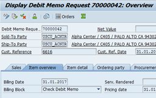

## Exercise 6 - Adapt your Custom Code

- [Exercise 6 - Adapt your Custom Code](#exercise-6---adapt-your-custom-code)
  - [You will](#you-will)
    - [Adapt your Custom Code](#adapt-your-custom-code)
  - [Summary \& Next Exercise](#summary--next-exercise)
    - [Summary](#summary)
    - [Next Exercise](#next-exercise)

<!-- Exercise Description -->
After SAP S/4HANA conversion you need to adapt incompatibilities in your custom code to SAP S/4HANA. For this purpose, you need to fix the SAP S/4HANA findings of the corresponding ATC check results from your custom code. Findings of the SAP S/4HANA checks are related to SAP S/4HANA simplifications. Each simplification requires a different approach to solve findings. Therefore, findings of SAP S/4HANA checks refer to the relevant SAP Notes which describe how you can solve them. 

This exercise simulates the following situation. After S/4HANA conversion some of your custom ABAP programs don’t run correctly or result in errors or even dumps. Therefore, your task is to carry out functional adaptation for every program to establish the correct behavior. 

**Example:** The program Z_CCM_DASHB_TRANSACTIONS_##(where ## is your group number) dumps.

| Issue                                        | Solution                                     |
| -------------------------------------------- | -------------------------------------------- |
|  |  |

### You will 
- Use ATC in ABAP Development Tools for Eclipse
- Check your custom programs for S/4HANA readiness with ATC
- Work with your ATC results and fix the ATC findings one by one
-	Learn how Quick fixes will support you with semi-automated custom code adaptation   

> **Reminder:**   
> Don't forget to replace all occurences of the placeholder **`###`** with your assigned group number in the exercise steps below.  
> You can use the ADT function **Replace All** (**Ctrl+F**) for the purpose.   
> If you don't have a group number, choose a 3-digit suffix and use it for all exercises.

---

#### Adapt your Custom Code

---

  
🔵 Click to expand to see the Exercise

---
1.  Start your ABAP Development Tools with not yet started and create a new ABAP Project connecting to the**

    SAP  S/4HANA 2023 system
    IP: X.X.X.X ( provided in the Handouts )

    

---
2.  Logon to the System:

        User: DEVELOPER##

        Pwd: Welcome1

        Client: 100

    

    

---
3.  Add your exercise package to your favorite packages

    Z_CCM_EX_##

    

---
4.  Unfold your exercise package

        Z_CCM_EX_##
    
    in the Project Explorer, select the program

        Z_CCM_DASHB_TRANSACTIONS_##

    and execute it by

        Run As ->ABAP Application (F8)

    

---
5. Choose
        
        MB11

    

    

    and click Execute (F8) button. The issue is, that in SAP S/4HANA the transaction MB11 is obsolete and it doesn’t start.

    Now execute the program Z_DASHB_TRANSACTIONS_## again and this time choose
        
        MATGRP03

    Click Execute (F8) button.

    The issue is now, that the call of the MATGRP03 transaction causes runtime error and your program dumps.
   
    

    

    It’s time to analyze it.

---
6. Run ATC for the program 

       Z_DASHB_TRANSACTIONS_##

    For this, select the program in the Project Explorer and use the context menu

       Run As -> ABAP Test Cockpit With…

    

---
7.  Enter the check variant S4HANA_READINESS and click Ok button.

    REMARK: you are now executing ATC locally in your S/4HANA system and therefore the local check variant

        S4HANA_READINESS

    is used.

    You get a worklist with the ATC findings, which you need to fix.

    

    

---
8.  Click on the first ATC finding to display the Details. Look up the error using the SAP Note number. 

    As you can see from the SAP Note, the transaction MB11 is obsolete in SAP S/4HANA and must be replaced by the transaction MIGO.

    

    Note: by the way, if you step to the error prone source code position in the editor and hover over the error marker, you will see the error message as well.

    

    Resolve the finding.
    
    

    You can also look up the solution in the related solution program
    
        Z_DASHB_TRANSACTIONS_SOL

    in the

        Z_CCM_SOLUTIONS

    package for your convenience. 

    Save and Activate the source.

    

    

---
9.  Execute ATC for all other programs in your exercise  package

        Z_CCM_EX_##

    and try to fix SAP S/4HANA findings (as in example above) using the corresponding SAP Notes.

    You can verify your attempts using already adapted programs from the

        Z_CCM_SOLUTIONS 

    package.

    

---
10. Next step is to play around with the Quick fixes in Eclipse.

    Go back to the ATC problems view and right-click on the first finding in the list. You should see an entry “Recommended Quick fixes”. Choose this option and see what happens. 

    

---
11. You can also navigate from the ATC problem view to the finding in the ABAP editor and execute the Quick fix from there by using shortcut

        CTRL+1

    

---
12. The Quick fixes can also be executed in a bulk mode. Just go back to ATC problem view and mark a set of findings (or all if you like) and choose again the option Recommended Quick Fix. 

    

    Also play around with the wizard and compare the original source and the refactored source in the wizard 

---

### Summary & Next Exercise
[^Top of page](#)

#### Summary

**You learned how to:**

- 🧪 **Use ATC in ADT (Eclipse)**
  - Run ABAP Test Cockpit (ATC) checks directly within ABAP Development Tools for Eclipse.
  - Ideal for developers to proactively check custom code during development or remediation.

- ✅ **Check Custom Programs for S/4HANA Readiness**
  - Use ATC to identify:
    - Syntax issues
    - Simplification item impacts
    - Performance and security concerns
  - Ensures your code is compatible with S/4HANA.

- 🛠️ **Work with ATC Results**
  - Review findings in the ATC Result View.
  - Filter, sort, and navigate directly to the source code.
  - Fix issues one by one, guided by detailed descriptions and recommendations.

- ⚡ **Use Quick Fixes for Semi-Automated Adaptation**
  - ADT offers Quick Fixes for many common ATC findings.
  - These provide semi-automated corrections, speeding up the adaptation process and reducing manual effort.

#### Next Exercise
You can continue with the next exercise - **[Exercise 7 - ABAPGIT - Migrate existing Code to the SAP BTP ABAP Environment (Steampunk)](../ex7/README7.md)**.
